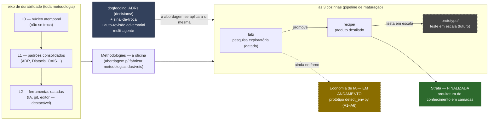

# Methodologies — uma oficina para construir metodologias que **duram**

> Você acumula trabalho — pesquisa, código, decisões, notas. Com o tempo ele
> apodrece: você não acha o que decidiu, não sabe o que ainda vale, e a próxima
> ferramenta ameaça obrigar a recomeçar. **Este repositório não é o manual de uma
> metodologia — é uma abordagem para fabricá-las** de um jeito que sobrevive à
> troca de ferramenta. É a oficina; [**Strata**](#produto-em-destaque-strata) é o
> primeiro produto que saiu dela, e [uma segunda](#no-forno-economia-de-ia) está
> no forno.

A abordagem, em uma frase: separar o que é **atemporal** do que é **datado**,
maturar a ideia através de três cozinhas (`lab/` → `recipe/` → `prototype/`), e
**provar cada decisão aplicando o método a si mesmo** (ADRs, sinal-de-troca,
auto-revisão adversarial multi-agente).

**Lê-se por humano e por IA.** Os mesmos documentos servem de leitura para você
e de instrução para um agente: a navegação dedicada a IA está em
[`AGENTS.md`](AGENTS.md), e o produto é escrito para que um modelo (Claude,
Copilot…) consiga **aplicá-lo a um projeto** — ver [como pedir isso a uma IA](recipe/).
Que qualquer IA consiga, de fato, é uma afirmação que estamos testando empiricamente,
não assumindo.

## Quero… → vá para

| Quero | Vá para |
|---|---|
| **Usar um método pronto** | [`recipe/knowledge-architecture.md`](recipe/knowledge-architecture.md) (Strata) |
| **Entender a abordagem** de fabricar metodologias | [A abordagem](#a-abordagem) (abaixo) |
| Ver a **pesquisa em andamento** (2ª metodologia) | [`lab/2026-06-04-economia-ia-tokens/`](lab/2026-06-04-economia-ia-tokens/) |
| Por que decidimos assim | [`decisions/`](decisions/) (ADRs) |
| O mapa detalhado / o foco atual | [`MAP.md`](MAP.md) · [`STATUS.md`](STATUS.md) |

## A abordagem

Toda metodologia produzida aqui é organizada por **durabilidade** — quanto cada
parte resiste à passagem do tempo e à troca de ferramenta:

| Camada | O que é | Cadência de troca |
|---|---|---|
| **L0** | núcleo atemporal (princípios que precedem o computador) | quase nunca |
| **L1** | padrões consolidados (ADR, Diataxis, OAIS, Conventional Commits…) | quando o padrão é superado |
| **L2** | ferramentas datadas (IA, git, editores) | a cada ciclo de ferramenta — **destacável** |

E a ideia amadurece por **três cozinhas** (um pipeline de maturação):

- **`lab/`** — pesquisa exploratória, datada e honesta (pode estar errada).
- **`recipe/`** — o que sobreviveu, destilado em produto portável.
- **`prototype/`** — o produto testado em escala, em projetos reais.

O que torna isto uma *abordagem* e não um guia ad-hoc: **o método se aplica a si
mesmo** (dogfooding). As decisões de design viram ADRs em [`decisions/`](decisions/);
cada formalização carrega um **sinal-de-troca** (quando aposentá-la sem perder o
princípio); e as conclusões passam por **auto-revisão adversarial** (vários agentes
tentando derrubar o achado antes de aceitá-lo). É por isso que a cura não apodrece
junto com a ferramenta.

## Produto em destaque: Strata

[`recipe/knowledge-architecture.md`](recipe/knowledge-architecture.md) — **arquitetura
do conhecimento em camadas**. Metodologia para organizar, rastrear e gerar
conhecimento em qualquer trabalho intelectual que acumula artefatos.

O problema é **anterior ao computador**: bibliotecários, cientistas e engenheiros o
enfrentam há séculos. As ferramentas de cada era (hoje: IA, editores, controle de
versão) são **formas** que expressam esse método — moldam, mas não fundam.

- **Formato:** 1 arquivo, ~800 linhas, portável (viaja sozinho). **Versão 1.1.0** ·
  licença CC BY-SA 4.0. (A versão canônica fica no frontmatter do próprio arquivo.)
- **Maturidade:** o **L0 (núcleo) está consolidado e verificado** (22 fontes
  primárias + varredura de atemporalidade). **Ainda em desenvolvimento:** o **eixo
  de segurança** (§6-bis, autoridade-para-agir) merece uma varredura própria, e a
  **Parte IV — adoção e operação** (brownfield em escala) ainda não foi escrita.
- **Detalhe sob demanda:** o índice das 12 seções do L0, a régua de *quando aplicar
  cada uma* (§9), os guias de **uso / brownfield / transporte** e **como usá-lo com
  uma IA** vivem com o produto — veja [`recipe/`](recipe/).

## No forno: economia de IA

[`lab/2026-06-04-economia-ia-tokens/`](lab/2026-06-04-economia-ia-tokens/) — **EM
ANDAMENTO** (ainda nada destilado para `recipe/`). Investiga como usar bem os
recursos de IA: custo de tokens, modelos locais (RTX 3060) vs nuvem, integração com
o editor, e roteamento por tipo de ambiente.

Já tem **instrumentos medidos** (baseline de tokens congelada, benchmarks de GPU) e
um **protótipo funcional** — `prototipo/detect_env.py` classifica a máquina do dev em
arquétipos (A1–A6) e emite *ligar agora / considerar / bloqueado* com o porquê.

## Mapa do repositório

| Pasta | O que é |
|---|---|
| [`recipe/`](recipe/) | **produtos prontos** — hoje: Strata (`knowledge-architecture.md`) |
| [`lab/`](lab/) | pesquisa exploratória, datada (fundamentação-L0, future-proof, aderência/portabilidade, **economia de IA**) |
| [`prototype/`](prototype/) | teste em escala, em projetos reais (futuro) |
| [`decisions/`](decisions/) | ADRs — por que cada decisão de design foi tomada |
| [`AGENTS.md`](AGENTS.md) · [`MAP.md`](MAP.md) · [`STATUS.md`](STATUS.md) | navegação (IA / mapa / foco atual) |

## Usar e adotar

Strata é projetado para viajar sozinho — copie o arquivo e leia a Parte I (L0); o
§9 diz o que aplicar à sua escala. Os passos de **uso, adoção em projeto existente
(brownfield) e transporte** vivem no [próprio produto](recipe/knowledge-architecture.md),
junto das fundamentações *inline* que tornam qualquer cópia auto-suficiente.

## Licença

[CC BY-SA 4.0](LICENSE) — atribuição obrigatória, derivados sob a mesma licença.
