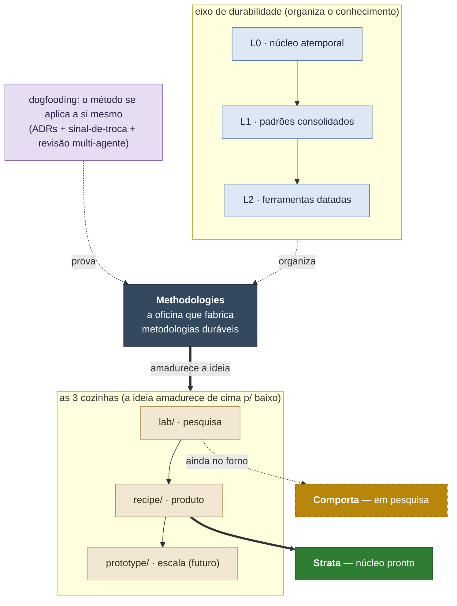

# Methodologies — uma oficina para construir metodologias feitas para **durar**

> Você acumula trabalho — pesquisa, código, decisões, notas. Com o tempo ele
> apodrece: você não acha o que decidiu, não sabe o que ainda vale, e a próxima
> ferramenta ameaça obrigar a recomeçar. **Este repositório não é o manual de uma
> metodologia — é uma abordagem para fabricá-las** de um jeito que sobrevive à
> troca de ferramenta. **Esta é a nossa oficina**; [**Strata**](#produto-em-destaque-strata)
> é o primeiro produto que saiu dela, e [**Comporta**](#no-forno-comporta) — a segunda
> metodologia — está no forno.

A abordagem, em uma frase: separar o que é **atemporal** do que é **datado**,
maturar a ideia em três estágios — da pesquisa exploratória ao produto pronto —, e
**provar cada decisão aplicando o método a si mesmo** (registrando por escrito o porquê
de cada escolha e submetendo cada conclusão a uma revisão crítica antes de aceitá-la) —
endurecendo o resultado contra o tempo, a troca de ferramenta **e o uso hostil**.

**Lê-se por humano e por IA.** Os mesmos documentos servem de leitura para você e de
instrução para um agente, e os produtos são escritos para que **uma IA** consiga
**aplicá-los ao seu projeto** — ver [como pedir isso a uma IA](recipe/). E não é só
teoria: **várias IAs populares — de diferentes fornecedores (OpenAI, Google, Anthropic),
das econômicas às de topo — já leem e aplicam o primeiro produto (o Strata) nos casos que
medimos**, cada uma até o seu limite (mapeado na
[opinião de uso](lab/2026-06-04-strata-hipoteses/OPINIAO-DE-USO.md)); **Comporta** seguirá
o mesmo princípio. *(A navegação dedicada a IA fica em [`AGENTS.md`](AGENTS.md).)*

## Quero… → vá para

Atalhos por intenção:

| Quero | Vá para |
|---|---|
| **Usar um método pronto** | [`recipe/knowledge-architecture.md`](recipe/knowledge-architecture.md) (Strata) |
| **A opinião honesta de uso** do Strata (o que funciona, por tipo de tarefa, exigência e custo, com ressalvas) | [`OPINIAO-DE-USO.md`](lab/2026-06-04-strata-hipoteses/OPINIAO-DE-USO.md) |
| **Entender a abordagem** de fabricar metodologias | [A abordagem](#a-abordagem) (abaixo) |
| Ver a **pesquisa em andamento** (Comporta, 2ª metodologia) | [`lab/2026-06-04-economia-ia-tokens/`](lab/2026-06-04-economia-ia-tokens/) |
| Por que decidimos assim | [`decisions/`](decisions/) (ADRs) |
| O mapa detalhado / o foco atual | [`MAP.md`](MAP.md) · [`STATUS.md`](STATUS.md) |

## A abordagem

> *Esta seção é o "como funciona por baixo" — a engenharia da oficina. Se você só quer o produto,
> pule para [Strata](#produto-em-destaque-strata).*

Toda metodologia produzida aqui é organizada por **durabilidade** — quanto cada
parte resiste à passagem do tempo e à troca de ferramenta:

| Camada | O que é | Cadência de troca |
|---|---|---|
| **Mneme** · L0 | núcleo atemporal (princípios que precedem o computador) | quase nunca |
| **Morfé** · L1 | padrões consolidados (ex.: ADR, Diátaxis, OAIS, Conventional Commits) | quando o padrão é superado |
| **Órganon** · L2 | ferramentas datadas (IA, git, editores) | a cada ciclo de ferramenta — **destacável** |

As camadas têm nomes gregos — **Mneme** (memória), **Morfé** (forma), **Órganon** (instrumento)
— pela progressão *o que perdura → a forma → a ferramenta*; `L0/L1/L2` é o apelido técnico.
Etimologia e fundamentação no **[glossário](GLOSSARIO.md)**.

E a ideia amadurece por **três cozinhas** (um pipeline de maturação):

- **`lab/`** — pesquisa exploratória e datada, **posta à prova**: o que não se sustenta fica registrado como refutado (o resultado negativo também é conhecimento).
- **`recipe/`** — o que sobreviveu, destilado em produto portável.
- **`prototype/`** — o produto testado em escala, em projetos reais.

O que torna isto uma *abordagem* e não um guia de improviso: **o método se aplica a si
mesmo** (dogfooding). As decisões de design viram ADRs em [`decisions/`](decisions/);
cada formalização carrega um **sinal-de-troca** (quando aposentá-la sem perder o
princípio); e as conclusões passam por **revisão crítica multi-agente** (vários agentes
tentando derrubar o achado antes de aceitá-lo). É por isso que a cura não apodrece
junto com a ferramenta.

## Produto em destaque: Strata

[`recipe/knowledge-architecture.md`](recipe/knowledge-architecture.md) — **arquitetura
do conhecimento em camadas**. Metodologia para organizar, rastrear e gerar
conhecimento em qualquer trabalho intelectual que acumula artefatos.

**O que ele entrega:**
- Mantém o conhecimento do projeto **organizado e rastreável** à medida que ele cresce — nada importante se perde, e você sempre sabe o que ainda vale.
- Quando há um problema claro — uma informação que virou duas, ou algo antigo a aposentar —, **até uma IA acessível faz o conserto sem perder o histórico** (em vez de apagá-lo).
- Para o julgamento mais delicado de *quando é melhor não mexer*, o método aponta o caminho — mas a palavra final é sua (ou de um modelo mais capaz).

*Já há evidência disso em testes controlados; a comprovação no uso do dia a dia está em andamento.*

> **Escopo:** organiza e preserva o conhecimento que o trabalho produz — e **complementa** o seu
> jeito de ter ideias e de desenvolver (Scrum, TDD, design…), sem substituí-los. Indicado para
> projeto de **vida longa** que acumula artefatos. Quando/para quem, em detalhe:
> [`recipe/README.md`](recipe/README.md).

O problema é **anterior ao computador**: bibliotecários, cientistas e engenheiros o
enfrentam há séculos. As ferramentas de cada era (hoje: IA, editores, controle de
versão) são **formas** que expressam esse método — moldam, mas não fundam.

- **Formato:** 1 arquivo único, portável (viaja sozinho). **Versão 1.1.0** ·
  licença CC BY-SA 4.0. (A versão canônica fica no frontmatter do próprio arquivo.)
- **Maturidade:** o **núcleo da metodologia está consolidado e verificado** (22 fontes primárias, e a
  checagem de que ele independe das ferramentas de hoje). A **aplicação por IA** já tem evidência empírica
  (a IA acertou, nos casos testados, a hora de agir, a hora de não mexer e a hora de recusar instruções
  maliciosas) — **a opinião
  honesta de uso** (por tipo de tarefa, exigência e custo, com ressalvas) está em
  [`OPINIAO-DE-USO.md`](lab/2026-06-04-strata-hipoteses/OPINIAO-DE-USO.md); o **macro de como foi testado**
  no [hub de arquitetura e evidências](lab/2026-06-04-strata-hipoteses/ARQUITETURA-E-EVIDENCIAS.md).
  **Ainda em desenvolvimento:** a adoção em **projetos grandes que já existem**.
- **Detalhe sob demanda:** o índice das seções do núcleo, a régua de *quando aplicar cada uma* e o guia de
  **como usá-lo com uma IA** vivem com o produto — veja [`recipe/`](recipe/).
  (Uso, adoção em projeto existente e transporte: na seção **"Usar e adotar"**, abaixo.)

## No forno: Comporta

[`lab/2026-06-04-economia-ia-tokens/`](lab/2026-06-04-economia-ia-tokens/) —
**Comporta**, a 2ª metodologia, **em pesquisa** (ainda no forno — nada destilado para
`recipe/`). *Cada decisão é uma comporta* que abre o recurso certo e fecha o caro.
Investiga economia e roteamento de recursos de IA: custo de uso, **IA rodando no próprio
computador vs na nuvem**, integração com o editor, e qual recurso usar em cada situação.

Já tem **medições reais** e uma **primeira ferramenta que já roda**: analisa o computador
e diz se vale usar IA local — *ligar agora / considerar / bloqueado* — com o porquê.

## Mapa do repositório

| Pasta | O que é |
|---|---|
| [`recipe/`](recipe/) | **produtos prontos** — hoje: Strata (`knowledge-architecture.md`) |
| [`lab/`](lab/) | pesquisa exploratória, datada (fundamentação-L0, future-proof, aderência/portabilidade, **economia de IA**) |
| [`prototype/`](prototype/) | teste em escala, em projetos reais (futuro) |
| [`decisions/`](decisions/) | ADRs — por que cada decisão de design foi tomada |
| [`AGENTS.md`](AGENTS.md) · [`MAP.md`](MAP.md) · [`STATUS.md`](STATUS.md) | navegação (IA / mapa / foco atual) |

## Usar e adotar

Strata é projetado para viajar sozinho — copie o arquivo e leia o núcleo; uma régua
interna diz o que aplicar à sua escala. Os passos de **uso, adoção em projeto existente
e transporte** vivem no [próprio produto](recipe/knowledge-architecture.md),
junto das fundamentações *inline* que tornam qualquer cópia auto-suficiente.

## Licença

[CC BY-SA 4.0](LICENSE) — atribuição obrigatória, derivados sob a mesma licença.
