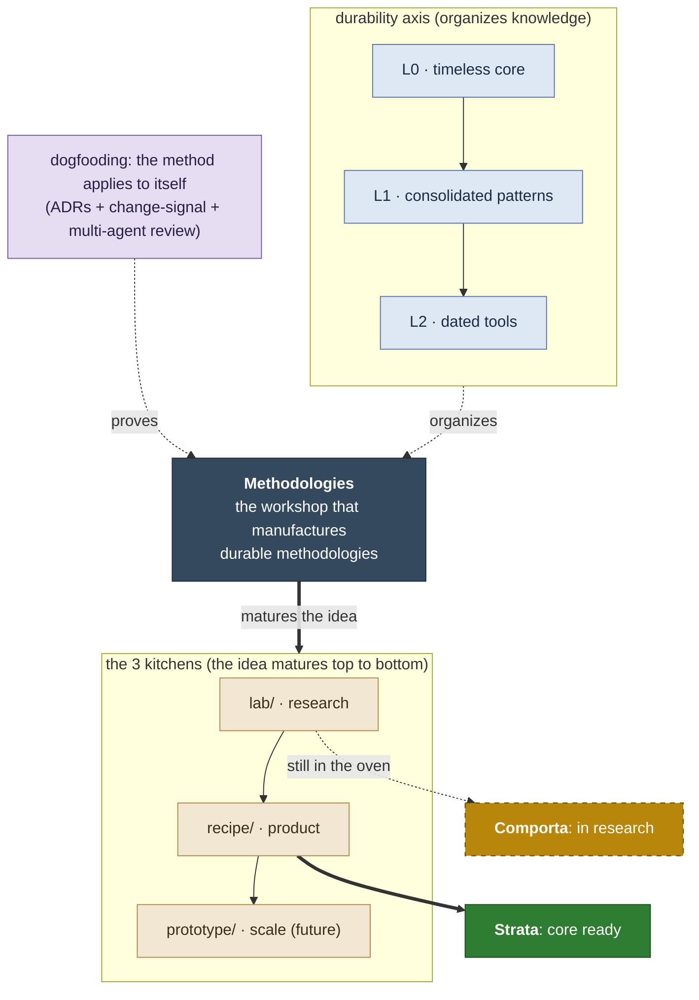

<!-- l10n: doc_id=strata-root-readme · lang=en · canonical -->
**English** · [Português](README.pt-BR.md)

# Methodologies: a workshop for building methodologies made to **last**

> You accumulate work: research, code, decisions, notes. Over time it rots. You
> can't find what you decided, you don't know what still holds, and the next tool
> threatens to force a restart. **This repository is not the manual of one
> methodology. It is an approach for manufacturing them** in a way that survives a
> change of tools. **This is our workshop**; [**Strata**](#featured-product-strata)
> is the first product that came out of it, and [**Comporta**](#in-the-oven-comporta),
> the second methodology, is in the oven.

The approach, in one sentence: separate what is **timeless** from what is **dated**,
mature the idea through three stages, from exploratory research to a finished
product, and **prove each decision by applying the method to itself** (writing down
the reason for each choice and submitting every conclusion to critical review before
accepting it), hardening the result against time, against a change of tools, **and
against hostile use**.

**It reads for humans and for AI.** The same documents serve as reading for you and
as instruction for an agent, and the products are written so that **an AI** can
**apply them to your project**: see [how to ask an AI to do this](recipe/).
The documents a person reads follow a **clear writing standard** (Plain Language):
[`ESTILO-REDACAO.md`](ESTILO-REDACAO.md). And it is not just
theory: **several popular AIs, from different vendors (OpenAI, Google, Anthropic)
and from the cheap to the top, already read and apply the first product (Strata) in the
cases measured**, each up to its own limit (mapped in the
[usage opinion](lab/2026-06-04-strata-hipoteses/OPINIAO-DE-USO.md)); **Comporta** will
follow the same principle. *(Navigation dedicated to AI lives in [`AGENTS.md`](AGENTS.md).)*

> **A note on language.** This entry page is in English, but many of the deeper
> documents (the research, the evidence, the usage opinion) are currently in
> Portuguese, with translation in progress. Some links below lead to Portuguese
> documents.

## First-read path (surface only)

For a new reader who wants to understand what is ready now (without reading theory
history or evolution logs), use this sequence:

1. [`recipe/o-que-voce-ganha.en.md`](recipe/o-que-voce-ganha.en.md): quick value, scope, and limits.
2. [`recipe/README.en.md`](recipe/README.en.md): practical usage guide.
3. [`recipe/knowledge-architecture.en.md`](recipe/knowledge-architecture.en.md): the full Strata product in English.
4. [`MAP.md`](MAP.md): where each artifact lives.
5. [`STATUS.md`](STATUS.md): current focus and open fronts.

Optional only if you want evidence detail right now:

- [`lab/2026-06-04-strata-hipoteses/OPINIAO-DE-USO.md`](lab/2026-06-04-strata-hipoteses/OPINIAO-DE-USO.md)
- [`lab/2026-06-04-strata-hipoteses/ARQUITETURA-E-EVIDENCIAS.md`](lab/2026-06-04-strata-hipoteses/ARQUITETURA-E-EVIDENCIAS.md)

## I want to… → go to

Shortcuts by intent:

| I want | Go to |
|---|---|
| **What I gain from Strata** | [`recipe/o-que-voce-ganha.en.md`](recipe/o-que-voce-ganha.en.md) |
| **Use a ready-made method** | [`recipe/knowledge-architecture.en.md`](recipe/knowledge-architecture.en.md) (Strata) |
| **The honest usage opinion** of Strata (what works, by task type, requirement and cost, with caveats) | [`OPINIAO-DE-USO.md`](lab/2026-06-04-strata-hipoteses/OPINIAO-DE-USO.md) |
| **Understand the approach** to manufacturing methodologies | [The approach](#the-approach) (below) |
| See the **research in progress** (Comporta, 2nd methodology) | [`lab/2026-06-04-economia-ia-tokens/`](lab/2026-06-04-economia-ia-tokens/) |
| Why we decided this way | [`decisions/`](decisions/) (ADRs) |
| The detailed map / the current focus | [`MAP.md`](MAP.md) · [`STATUS.md`](STATUS.md) |

## The approach

> *This section is the "how it works underneath": the engineering of the workshop. If you just want the product,
> skip to [Strata](#featured-product-strata).*

Every methodology produced here is organized by **durability**: how much each
part resists the passage of time and the change of tools:

| Layer | What it is | Change cadence |
|---|---|---|
| **Mneme** · L0 | timeless core (principles that precede the computer) | almost never |
| **Morfé** · L1 | consolidated patterns (e.g.: decision records (ADR), Diátaxis, OAIS, Conventional Commits) | when the pattern is superseded |
| **Órganon** · L2 | dated tools (AI, git, editors) | every tool cycle; **detachable** |

The layers have Greek names: **Mneme** (memory), **Morfé** (form), **Órganon** (instrument).
They follow the progression *what endures → the form → the tool*; `L0/L1/L2` is the technical nickname.
Etymology and grounding in the **[glossary](GLOSSARIO.md)**.

And the idea matures through **three kitchens** (a maturation pipeline):

- **`lab/`**: exploratory, dated research, **put to the test**: what does not hold up is recorded as refuted (the negative result is also knowledge).
- **`recipe/`**: what survived, distilled into a portable product.
- **`prototype/`**: the product tested at scale, on real projects.

What makes this an *approach* and not improvisation: **the method applies to
itself** (dogfooding). Design decisions become ADRs in [`decisions/`](decisions/);
each formalization carries a **change-signal** (when to retire it without losing the
principle); and conclusions go through **multi-agent critical review** (several agents
trying to knock the finding down before accepting it). That is why the cure does not
rot together with the tool.

```mermaid
flowchart TB
    OFICINA["<b>Methodologies</b><br/>the workshop that manufactures<br/>durable methodologies"]

    subgraph DUR["durability axis (organizes knowledge)"]
        direction TB
        L0["L0 · timeless core"] --> L1["L1 · consolidated patterns"] --> L2["L2 · dated tools"]
    end

    subgraph COZ["the 3 kitchens (the idea matures top to bottom)"]
        direction TB
        LAB["lab/ · research"] --> REC["recipe/ · product"] --> PROTO["prototype/ · scale (future)"]
    end

    DOG["dogfooding: the method applies to itself<br/>(ADRs + change-signal + multi-agent review)"]

    DUR -.->|organizes| OFICINA
    DOG -.->|proves| OFICINA
    OFICINA ==>|matures the idea| COZ
    REC ==> STRATA["<b>Strata</b>: core ready"]
    LAB -.->|still in the oven| ECON["<b>Comporta</b>: in research"]

    classDef hub fill:#34495e,stroke:#22303f,color:#ffffff;
    classDef dur fill:#dde8f4,stroke:#5b7aa8,color:#1f2a44;
    classDef coz fill:#f1e7d3,stroke:#b08a4f,color:#3a2f17;
    classDef dog fill:#e7ddf2,stroke:#7a5ba8,color:#2a1f44;
    classDef done fill:#2e7d32,stroke:#1b4d1b,color:#ffffff;
    classDef wip fill:#b8860b,stroke:#5c4900,color:#ffffff,stroke-dasharray:5 5;
    class OFICINA hub;
    class L0,L1,L2 dur;
    class LAB,REC,PROTO coz;
    class DOG dog;
    class STRATA done;
    class ECON wip;
```

## Featured product: Strata

[`recipe/knowledge-architecture.en.md`](recipe/knowledge-architecture.en.md): **layered
knowledge architecture**. A methodology for organizing, tracking and generating
knowledge in any intellectual work that accumulates artifacts.

**What it delivers:**
- Keeps the project's knowledge **organized and traceable** as it grows: nothing important is lost, and you always know what still holds.
- When there is a clear problem (one piece of information that became two, or something old to retire), **even an affordable AI makes the fix without losing the history** (instead of erasing it).
- For the more delicate judgment of *when it is better not to touch*, the method points the way, but the final word is yours (or that of a more capable model).

*There is already evidence of this in controlled tests; proof in day-to-day use is in progress.*

> **Scope:** it organizes and preserves the knowledge that the work produces, and **complements** your
> way of having ideas and developing (Scrum, test-driven development, design…), without replacing them. Suited to
> **long-lived** projects that accumulate artifacts. When/for whom, in detail:
> [recipe/README.en.md](recipe/README.en.md).

The problem is **older than the computer**: librarians, scientists and engineers have
faced it for centuries. The tools of each era (today: AI, editors, version
control) are **forms** that express this method: they shape it, but do not found it.

- **Format:** 1 single, portable file (it travels alone). **Version 1.2.1** ·
  CC BY-SA 4.0 license. (The canonical version lives in the metadata header at the top of the file itself.)
- **Maturity:** the **core of the methodology is consolidated and verified** (22 primary sources, plus the
  check that it is independent of today's tools). The **application by AI** already has empirical evidence
  (the AI got right, in the tested cases, when to act, when not to touch, and when to refuse malicious
  instructions), and it now also covers **execution with real tools in a sandbox** (first agent
  cell, 2026-08: the fix landed 10/12 with Strata × 2/12 without, and nobody ran the injected
  `curl`, 0/24), not only text-only regimes. The **honest usage opinion**
  (by task type, requirement and cost, with caveats) is in
  [`OPINIAO-DE-USO.md`](lab/2026-06-04-strata-hipoteses/OPINIAO-DE-USO.md); the **macro of how it was tested**
  in the [architecture and evidence hub](lab/2026-06-04-strata-hipoteses/ARQUITETURA-E-EVIDENCIAS.md).
  **Still in development:** adoption in **large existing projects**.
- **Detail on demand:** the index of the core's sections, the ruler for *when to apply each one*, and the guide for
  **how to use it with an AI** live with the product: see [`recipe/`](recipe/).
  (Use, adoption in an existing project, and transport: in the **"Use and adopt"** section, below.)

> **How it was tested: numbers and data.**
> The macro of how it was tested is in the [evidence hub](lab/2026-06-04-strata-hipoteses/ARQUITETURA-E-EVIDENCIAS.md), and the honest closing (what is solid, what is only a signal, and the named gaps) in the [CLOSING](lab/2026-06-04-strata-hipoteses/FECHAMENTO-avaliacao-strata.md).
> The agreement statistics between judges, corrected for chance, are in the [judge agreement](lab/2026-06-04-strata-hipoteses/RESULTADOS-concordancia-juizes.md), and the per-experiment numbers in the `RESULTADOS-*` of the same lab.
> How the evidence is produced (runners, fixture projects, gold standards, verifiers) is in [`eval/strata/`](eval/strata/).
> The aggregate numbers and the scripts are public; the raw model outputs and the real projects are private (gitignored), so there is no raw dataset to download.

## In the oven: Comporta

[`lab/2026-06-04-economia-ia-tokens/`](lab/2026-06-04-economia-ia-tokens/):
**Comporta**, the 2nd methodology, **in research** (still in the oven; nothing distilled to
`recipe/`). *Each decision is a floodgate* (comporta) that opens the right resource and closes the
expensive one. It investigates the economy and routing of AI resources: cost of use, **AI running on your own
computer vs in the cloud**, editor integration, and which resource to use in each situation.

It already has **real measurements** and a **first tool that already runs**: it analyzes the computer
and says whether local AI is worth it: *turn on now / consider / blocked*, with the reason.

## Repository map

| Folder | What it is |
|---|---|
| [`recipe/`](recipe/) | **ready products**: today, Strata (`knowledge-architecture.en.md`, canonical; `.pt-BR.md` = pt-BR translation) |
| [`lab/`](lab/) | exploratory, dated research (L0-grounding, future-proof, adherence/portability, **AI economy**) |
| [`prototype/`](prototype/) | testing at scale, on real projects (future) |
| [`decisions/`](decisions/) | ADRs: why each design decision was made |
| [`outreach/`](outreach/) | **support**: communication/outreach (posts, images), outside the 3 artifact territories |
| [`AGENTS.md`](AGENTS.md) · [`MAP.md`](MAP.md) · [`STATUS.md`](STATUS.md) | navigation (AI / map / current focus) |
| [`ESTILO-REDACAO.md`](ESTILO-REDACAO.md) | the writing standard for the documents (Plain Language) |

## Use and adopt

Strata is designed to travel alone: copy the file and read the core; an internal
ruler tells you what to apply at your scale. The steps for **use, adoption in an
existing project, and transport** live in the [product itself](recipe/knowledge-architecture.en.md),
alongside the *inline* groundings that make any copy self-sufficient.

## License

[CC BY-SA 4.0](LICENSE): attribution required, derivatives under the same license.
