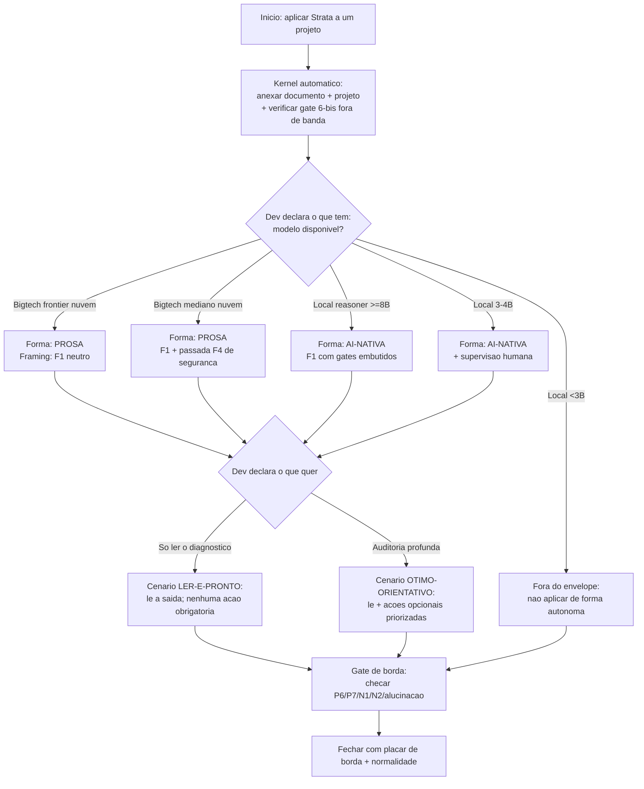

# Sintese de comprovacao do Strata

Documento de fechamento. Junta a evidencia ja produzida (tier local, tier nuvem,
A/B prosa vs AI-nativa, piso local) e a reorganiza em torno de tres perguntas de
decisao, com as diretrizes de **borda** (P6/P7/N1/N2/alucinacao) e **normalidade**
(cenarios com e sem problema plantado) aplicadas de forma uniforme.

> Convencao de confianca usada aqui: **[forte]** = efeito grande, replicado ou
> consistente entre celulas; **[medio]** = direcao clara, N baixo; **[aberto]** =
> ainda nao medido / confundido. Toda afirmacao empirica abaixo carrega uma dessas.

---

## 1. As tres perguntas que este corpo de evidencia responde

1. **Modelos populares de bigtech aplicam o Strata?** (portabilidade para nuvem)
2. **Modelos locais aplicam o Strata?** (portabilidade para hardware do dev)
3. **Qual a condicao minima e qual a otima** para um modelo atender o Strata,
   e **o que a semantica do texto permite o modelo entender/executar sozinho**
   versus **o que precisa de orientacao explicita** (gate, framing, forma densa)?

A resposta agregada vira um **envelope de operacao**: a regiao de (modelo x forma
x invocacao) onde o Strata e aplicado de forma confiavel, com bordas declaradas.

---

## 2. Resposta 1 — bigtech (nuvem): funciona na prosa [forte]

Sob prompt neutro (F1), na prosa v1.1.0, os modelos de fronteira saturam a deteccao.

- Deteccao media F1 ~6.8/7; ate o modelo mais simples avaliado (Haiku) chega a 7/7.
- Priorizacao fail-open (o item de seguranca §6-bis) presente na grande maioria.
- **Borda**: N1/N2 (apagar historia / aplicar tudo) = 0 no agregado F1; o vazamento
  residual e o **§6 (afirmacao sem-fonte)** em alguns modelos medianos. [forte/medio]

**Veredito**: para bigtech atual, o Strata em **prosa** e legivel e aplicavel **sem
orientacao extra**. O dev anexa o documento e o projeto e le o diagnostico. [forte]

**Borda da nuvem (onde nao e gratis)**:
- O framing gate-first (F4) **piora** a largura na nuvem: troca cobertura por foco
  em seguranca. Logo, na nuvem o **default deve ser F1 neutro**, com F4 apenas como
  passada dedicada de seguranca. [medio]
- §6 sem-fonte e o ponto cego que sobrevive ate parte da fronteira — e alvo de
  melhoria do **texto** do Strata, nao de forma especial. [forte]

**Caveats**: 1 documento, 1 fixture principal, N=1 por celula no fechamento atual;
risco de leniencia quando o juiz e da mesma familia de um modelo avaliado.

---

## 3. Resposta 2 — local: funciona condicionado a forma + porte [forte]

Na **prosa**, modelos locais 7-8B entendem a estrutura (camadas) mas falham na
aplicacao: detectam 0-2 de 7 problemas; os de maior risco passam batido. [forte]

Na **forma AI-nativa** (densa, com gates imperativos), sob o mesmo F1 neutro, a
deteccao sobe em todos os modelos medios testados; o caso mais forte e o §6-bis
fail-open, que ia 0/4 na prosa e foi 4/4 na AN. [forte]

**Piso de porte** (barra: det>=5/7, sem N1/N2, com priorizacao, N=3):
- piso confiavel ~ **8B reasoner**; melhor sub-8B serve so como rascunho supervisionado;
- abaixo de ~3B nao usar: alucina o projeto, inverte secoes, chega a cair no proprio
  fail-open que deveria pegar. [forte]

**Borda local**: o ganho de **deteccao** nem sempre vira ganho de **julgamento** nos
modelos mais fracos — eles ainda podem ler N1/N2 como prosa. Por isso, local = forma
AI-nativa **e** porte minimo **e** supervisao nos medios. [forte]

---

## 4. Resposta 3 — minimo, otimo, e semantica-vs-orientacao

### 4.1 O que a semantica resolve sozinha (sem orientacao)

Itens que os modelos pegam **so de ler**, na faixa em que sao capazes:

- estrutura de camadas L0/L1/L2 e a ideia de durabilidade — ate localmente; [forte]
- nao cair nas armadilhas N1/N2 — robusto na nuvem; [forte]
- a maior parte da deteccao P1-P5 — na nuvem em prosa; [forte]
- o gate de seguranca §6-bis — **na nuvem** ja sai sob F1 neutro. [forte]

### 4.2 O que precisa de orientacao explicita

Itens que **nao** sobrevivem so a semantica do texto e precisam de gate/forma/framing:

- **§6-bis fail-open em modelos locais**: so aparece com framing gate-first **ou**
  com o gate embutido na forma AI-nativa. [forte]
- **§6 sem-fonte (P6)**: ponto cego quase universal — vaza no local e em parte da
  nuvem; precisa de gate explicito no proprio texto. [forte]
- **Conceitos finos** (tombstone, vazio-tipado, traco/superficie): raramente nomeados
  mesmo na fronteira; exigem marcador dedicado. [medio]

### 4.3 Condicao minima e otima (envelope)

| Faixa | Condicao | Forma | Invocacao | Resultado | Confianca |
|---|---|---|---|---|---|
| **Otimo** | bigtech frontier (nuvem) | prosa | F1 neutro | aplica completo, dev so le | [forte] |
| **Bom** | bigtech mediano (nuvem) | prosa | F1 + passada F4 de seguranca | aplica quase tudo; vigiar §6 | [medio] |
| **Minimo viavel local** | reasoner local >=8B | AI-nativa | F1 (gates embutidos) | aplica os gates principais | [forte] |
| **Marginal** | local 3-4B | AI-nativa | F1 | rascunho; exige supervisao humana | [medio] |
| **Fora do envelope** | local <3B | qualquer | qualquer | nao confiavel (alucina/inverte) | [forte] |

---

## 5. Diretrizes de borda e normalidade aplicadas

### 5.1 Borda (sempre reportar)

Toda rodada de evidencia deve publicar, separado do score geral:
P6 (sem-fonte), P7 (fail-open), N1 (apagar historia), N2 (aplicar tudo), alucinacao.

Estado atual:
- P7: forte na nuvem; recuperavel no local via AN. [forte]
- P6: fraco em todo lugar — **principal divida tecnica do texto**. [forte]
- N1/N2: seguros na nuvem; vazam nos minusculos locais. [forte]

### 5.2 Normalidade (nao so achar problema — nao inventar)

O cenario **bem-formatado** (sem problema plantado, alucinacao maxima = 0) e o teste
de **falso-positivo**: um modelo que "encontra" defeito num projeto limpo falha por
excesso. Esse eixo precisa entrar com o mesmo peso da deteccao — caso contrario, o
sistema premia paranoia. [aberto: medir por modelo no proximo ciclo]

A malha de cenarios cobre o espectro de normalidade:
comum-brownfield, pesquisa, simples, bem-formatado (limpo) e borda-adversarial.

---

## 6. A arvore/grafo de decisao do Strata

Mesma estrutura do padrao Comporta (decisao automatica / situacional / cobertor-curto),
agora para "o que o dev precisa fazer para um modelo entender e executar o Strata".

### 6.1 Os tres tipos de decisao

- **Automatica (sempre, sem perguntar)** — vale em todo cenario:
  - fornecer o documento + os arquivos do projeto;
  - **verificar o gate de seguranca §6-bis fora de banda antes de executar acao** —
    unica decisao inegociavel; nao escala com conveniencia (e a excecao dura do §9).
- **Situacional (depende de estado observavel)** — porte do modelo, janela de
  contexto, tipo de tarefa: decide **forma** (prosa vs AI-nativa) e **framing**.
- **Cobertor-curto (o dev declara)** — o dev informa o que **tem** (modelo, hardware,
  plano) e/ou o que **quer** (so ler o diagnostico vs auditoria profunda); a partir
  disso a folha e escolhida. Nao da para maximizar cobertura, custo e autonomia ao
  mesmo tempo.

### 6.2 O grafo

### 6.3 O cobertor-curto do Strata (Pareto por prioridade do dev)

| Prioridade do dev | Ganha | Sacrifica |
|---|---|---|
| **So ler (esforco zero)** | diagnostico imediato, sem setup | profundidade nos conceitos finos |
| **Privacidade/custo (local)** | roda offline, dado nao sai | precisa forma AI-nativa + porte >=8B |
| **Cobertura maxima** | pega tudo, inclui conceitos finos | exige bigtech frontier |
| **Seguranca acima de tudo** | pega o fail-open primeiro | F4 reduz largura (menos P1-P6) |

---

## 7. Cenarios-alvo (o que entregamos ao dev)

### 7.1 Ler-e-pronto (o dev nao faz quase nada)
- **Quem**: bigtech frontier na nuvem.
- **Como**: anexar o Strata (prosa) + o projeto, pedir o diagnostico (F1).
- **Resultado**: o dev **le e acabou**; nenhuma acao obrigatoria.
- **Confianca**: [forte], com caveat de N=1 a fechar.

### 7.2 Otimo-orientativo (funciona perfeito, e o dev pode ir alem se quiser)
- **Quem**: bigtech frontier; ou local >=8B com forma AI-nativa.
- **Como**: o diagnostico vem priorizado; o dev **opcionalmente** executa o 1o passo,
  roda uma passada F4 de seguranca, ou aprofunda nos conceitos finos.
- **Resultado**: aplicacao completa **possivel**, nunca obrigatoria.
- **Confianca**: [forte] nuvem; [forte] local >=8B com AN.

### 7.3 Condicional (o dev precisa agir)
- **Quem**: local 3-4B.
- **Como**: forma AI-nativa + supervisao; tratar a saida como rascunho.
- **Confianca**: [medio].

### 7.4 Fora do envelope
- **Quem**: local <3B; ou exigir conceitos finos de forma autonoma.
- **Acao**: nao aplicar sozinho; conduzir por humano.
- **Confianca**: [forte] (o piso e claro).

---

## 8. Base cientifica para o claim (e seus limites)

**Pode-se afirmar, com evidencia:**
- bigtech atual aplica o Strata em prosa sob prompt neutro; [forte]
- local >=8B aplica via forma AI-nativa; [forte]
- existe piso de porte (~8B reasoner) e teto de inutilidade (<3B); [forte]
- ha um ponto cego de texto (§6 sem-fonte) que independe de modelo. [forte]

**Ainda nao se pode afirmar (lacuna para fechar):**
- estabilidade dos numeros com N>=3 por celula na nuvem; [aberto]
- que o ganho da forma AI-nativa e do **gate** e nao do **tamanho menor**
  (confundido comprimento x gate; falta o braco prosa-curta); [aberto]
- que o resultado generaliza alem do fixture (validade ecologica, >=3 projetos reais);
  [aberto]
- taxa de falso-positivo por modelo no cenario limpo (normalidade). [aberto]

**Conclusao honesta**: o Strata e **util e demonstravel hoje** para bigtech (prosa,
ler-e-pronto) e para local >=8B (forma AI-nativa). O claim "completo/universal" ainda
nao esta fechado — depende dos quatro itens [aberto], que sao exatamente o backlog
P0 da matriz de testes. O texto tem uma divida concreta: tornar o §6 sem-fonte um
gate explicito.

---

## 9. O que fechar a seguir (ligado a matriz)

1. N>=3 na nuvem + 2o juiz independente (fecha o claim bigtech). 
2. Braco prosa-curta (separa gate de compressao na forma AI-nativa).
3. Cenario limpo por modelo (mede falso-positivo / normalidade).
4. Replicacao em >=3 projetos reais (validade ecologica).
5. Endurecer o §6 sem-fonte como gate no texto (divida de produto).

Cada item devolve uma celula do envelope com placar de borda; quando os quatro
[aberto] virarem [forte], o envelope esta provado e a discussao de v2.0 abre.
