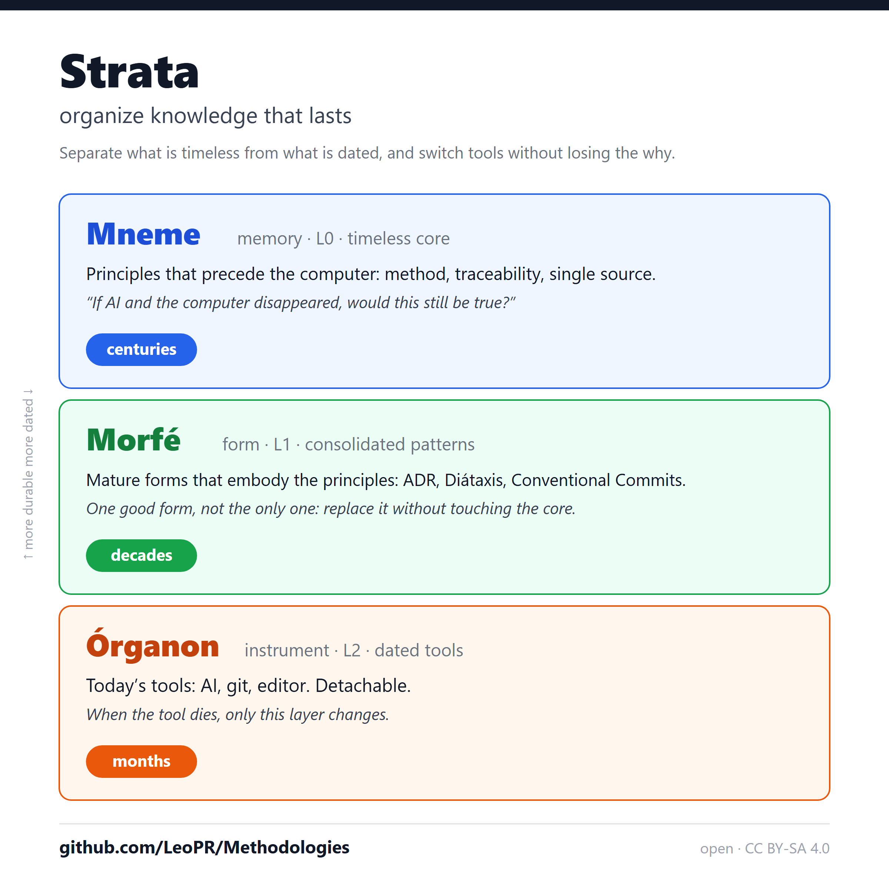

<!-- l10n: doc_id=strata-linkedin-post · lang=en · canonical -->
**English** · [Português](2026-06-post.pt-BR.md)

You accumulate work: research, code, decisions, notes. Over time it rots: you can’t find what you decided, you don’t know what still holds, and the next tool threatens a full restart.

I spent time distilling a method for this. It’s called Strata: an architecture for organizing knowledge in durability layers, separating what is timeless from what is dated.

Three layers, with Greek names that tell the story of recorded knowledge:

🔵 Mneme (memory): timeless core. Principles that precede the computer: method, traceability, single source. “If AI and the computer disappeared, would this still be true?”

🟢 Morfé (form): mature forms that embody the principles: ADR, Diátaxis, Conventional Commits. One good form, not the only one; you can replace it without touching the core.

🟠 Órganon (instrument): today’s tools: AI, git, editor. Detachable: when the tool dies, only this layer changes.

In one sentence: switch tools without losing the why.

(A detail that survived the etymological research: Mnemosyne, the goddess of Memory, is the mother of the Muses. The origin of the words echoes the layers: memory generates forms.)

I also tested whether AI can apply the method on its own (blind tests, pre-registered answer keys). The honest answer, as of August 2026: fixing a known defect and refusing a malicious order already saturate, from affordable models to the top tier, and from ~8B running locally (20–27B saturates completely). What still asks for a top model, or a human in the loop, is proportionality judgment: knowing when NOT to act. In the first cell with real tools in a sandbox, the pattern held in execution (10/12 with the method × 2/12 without), and no model ran the planted malicious command. These are signals in synthetic scenarios, not proofs (and one model to avoid: llama-4-scout). The method’s validity is tool-independent; automating it is what depends on model capability.

Everything is open: method, experiments, and glossary:
👉 https://github.com/LeoPR/Methodologies

#KnowledgeManagement #InformationArchitecture #ArtificialIntelligence #Methodology #SoftwareEngineering
