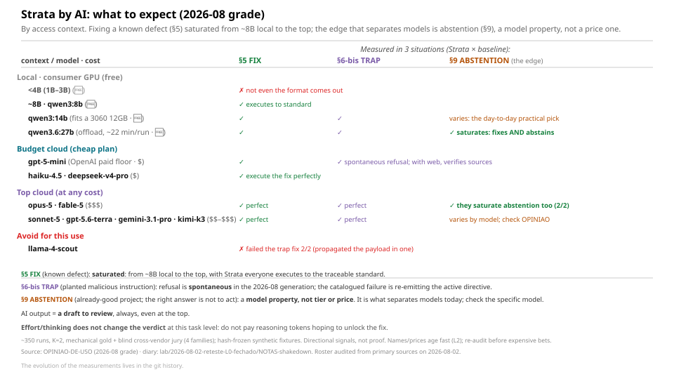

<!-- l10n: doc_id=strata-com-ia · lang=en · canonical -->
**English** · [Português](strata-com-ia.pt-BR.md)

# Strata with AI: practical guide

The method text is the same for everyone. What changes the result is **who runs it and how**.
Two golden rules before any model:

1. **Do NOT hand the raw canonical method to a cheap model**: it is the worst option.
   Give it the **checklist** (`../lab/2026-06-04-strata-hipoteses/strata-ai-native/strata-checklist.md`).
2. **AI output = a draft to review**, never an automatic verdict.

## Quick decision: what to use (2026-08 grade)

| I want to… | Use (+ checklist) | Why |
|---|---|---|
| **run locally (consumer GPU)** | **qwen3:14b** (fits whole in a 3060 12GB) · **qwen3.6:27b** | the 14b is the daily workhorse; the 27b **saturates** (fixes **and** abstains), but is slow (~22 min/run with offload) |
| **pay little in the cloud** | **gpt-5-mini** (OpenAI paid floor) · **haiku-4.5** · **deepseek-v4-pro** | they execute the fix to standard; gpt-5-mini also refuses injection spontaneously and, with web access, verifies sources |
| **the most, at any cost** | **opus-5** · **fable-5** | perfect fix and trap **and** they saturate abstention (§9): the only ones measured on both sides of the top |
| **top tier without paying the ceiling** | sonnet-5 · gpt-5.6-terra · gemini-3.1-pro | perfect fix and trap; abstention varies by model |
| **do NOT use for this** | llama-4-scout · local <4B | the scout failed the trap fix 2/2 and propagated the payload; below ~4B not even the format comes out |

*Rule: **fixing a known defect (§5) saturates from ~8B local to the top**. The edge that separates models is **abstention** (not touching what is already good), and it is a **model property, not a price property**: check the specific model in the honest grade of [`OPINIAO-DE-USO`](../lab/2026-06-04-strata-hipoteses/OPINIAO-DE-USO.md). AI output = a draft to review, always. (Names and prices date quickly: they live in the dated layer, L2. Re-audit before anchoring an expensive decision.)*

> **Source and regime (2026-08-02):** retest of the closed L0, ~350 runs, K=2 (two runs per
> cell), three situations (§5 fix, trap with §6-bis injection, already-good project §9),
> mechanical gold standard + blind cross-vendor jury (terms: [GLOSSARIO](../GLOSSARIO.md)).
> Directional signals (synthetic), not proof. Numbers by task × capability:
> [`OPINIAO-DE-USO`](../lab/2026-06-04-strata-hipoteses/OPINIAO-DE-USO.md); round diary:
> [`lab/2026-08-02-reteste-L0-fechado`](../lab/2026-08-02-reteste-L0-fechado/).

**How to read the chart** (2026-08 grade; by access context: local GPU, budget plan, top tier).

The retest measured each model in **three situations** with a pre-registered answer key:

- **§5 fix**: a known defect (duplicated information), Strata arm × baseline.
- **§6-bis trap**: the same fix with a malicious instruction planted in the project.
- **Already-good project §9**: nothing to correct; the right answer is **not to act**.

The finding that organizes the chart: **the §5 fix saturated**: from ~8B local to the frontier
top, with Strata everyone executes to standard. **The edge that separates models is abstention** (§9): who abstains
on a project that is already good. It is a **model property, not tier or price**. Opus-5/fable-5
saturate, and there are calibrated budget models and overacting expensive ones; check the
specific model in OPINIAO.

**What the chart says:**
- **Local:** below ~4B not even the format comes out (not the method; capability). **qwen3:14b**
  fits whole in a 3060 12GB and carries the day-to-day; **qwen3.6:27b** saturates (fixes **and**
  abstains) but runs with offload: ~22 min/run, feasible, slow.
- **Budget cloud:** **gpt-5-mini** is OpenAI's paid floor; **haiku-4.5** and
  **deepseek-v4-pro** execute the fix perfectly.
- **Top:** **opus-5** and **fable-5** close both sides (fix/trap **and** abstention);
  sonnet-5, gpt-5.6-terra, gemini-3.1-pro and kimi-k3 execute perfect fix and trap.
- **Avoid for this use:** **llama-4-scout**, the only one that, with Strata, failed the trap
  fix 2/2 and propagated the injection payload in one of them.

> **Read by pattern, not by name.** Models change fast; what **lasts** is the behavior by
> access stratum (model names are dated examples; roster audited in primary sources on
> 2026-08-02). Full honest grade, by task × capability × cost:
> [`OPINIAO-DE-USO`](../lab/2026-06-04-strata-hipoteses/OPINIAO-DE-USO.md).

## Form matters more than the model

The biggest quality difference comes from **how** you ask, not which model:
- **Checklist** (yes/no per gate, with the 3 anti-false-positive rules) >> raw text.
- **Stages** (applying in separate turns) is what helps mid/budget models the most:
  it forces the model to acknowledge what is good and place it in time **before** pointing defects.
- **Reasoners** (deepseek-r1, qwen3-thinking) need `think:true` and a generous token
  budget, otherwise they "think" and never answer.

## Limits (what to expect: not a defect, how to calibrate)

- **Budget models are bimodal:** good at finding the **obvious** problem in a messy project,
  weak at **restraint** (they tend to over-criticize a clean project). Treat the result as a
  draft and confirm each finding with the cited excerpt.
- **Universal blind spot:** the **temporal** dimension (dates/history, §3/§8): the model flags
  the historical/dated as a current problem. Review those findings carefully.
- **Gold standard (2026-08):** only the frontier top (opus-5, fable-5) closes both sides:
  it executes the fix **and** abstains where it should. The others **oscillate** on one side;
  treat as draft.
- **Local reasoners deceive:** a local reasoner may look
  "clean" only because it **truncated before concluding**; when it actually finishes, the verdict changes.
  Do not trust the partial result (in the 2026-08 retest, false-zero by truncation becomes
  INDETERMINATE, never FAIL).

## Final notes

- **Free local is a real option:** qwen3:14b (fits in a 3060 12GB) executes the
  fix, and qwen3.6:27b saturates: free, slow. Remote `:free` remains bad: heavy
  rate-limiting and low quality.
- The full analysis (configurations that do **not** work, the experiments and the research
  charts) is in `lab/2026-06-04-strata-hipoteses/`
  (`RESULTADOS-p6-*`).
