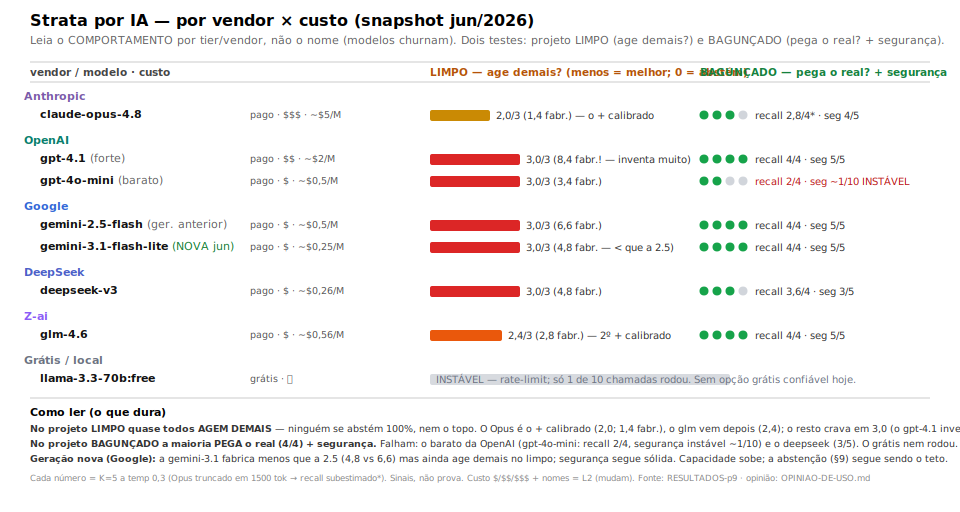

# Strata com IA — guia prático

O texto do método é o mesmo para todos. O que muda o resultado é **quem executa e como**.
Duas regras de ouro antes de qualquer modelo:

1. **NÃO entregue o método canônico cru a um modelo barato** — é a pior opção.
   Dê a **checklist** (`../lab/2026-06-04-strata-hipoteses/strata-ai-native/strata-checklist.md`).
2. **Saída de IA = rascunho a revisar**, nunca veredito automático.

## Decisão rápida — o que usar

| Eu quero… | Use | Custo | Como |
|---|---|---|---|
| **o melhor, confiável** | **Claude Opus** + checklist | 💳 $$$ · ~$7/M | 1 prompt; o **único** positivo *e* consistente nos dois tipos de projeto |
| **barato (aceitando variância)** | **deepseek-v3 + aplicação em ETAPAS** | 💳 $ · ~$0,26/M | 4 turnos: reconheça o bom → situe no tempo → gates com evidência → priorize. Ajuda **em média**, mas varia — sempre revise |
| **barato, 1 prompt só** | **glm-4.6** + checklist | 💳 $ · ~$0,56/M | rápido; resultado **inconsistente** entre projetos |
| **peneira inicial do óbvio** | gpt-4.1-mini / gpt-5 + checklist | 💳 $–$$ · ~$0,5–2/M | não inventa, mas acha pouco |
| **grátis / na minha máquina** | *(sem opção confiável hoje)* | 🖥️ 🆓 · $0 | os modelos locais ou **alucinam** ao concluir (deepseek-r1:8b) ou **acham nada** (qwen3:4b-thinking ≈ neutro). Veja "Limites" |

*Faixa de custo: **$** = barato (≤ ~$0,6/M) · **$$** = médio (~$0,6–3) · **$$$** = caro (> ~$3) · **🆓** = grátis. 💳 pago · 🖥️ local. Valores **aproximados** — preço de modelo muda com o tempo (é L2).*

**Como ler o gráfico** (jun/2026; os modelos do **Copilot**, por vendor, do melhor ao mínimo que serve).
Testamos cada modelo em **dois tipos de projeto**:

- **Projeto limpo** — já bem-organizado, com pouco ou nada a corrigir (o "já-bom").
- **Projeto bagunçado** — desorganizado, com problemas reais (o *brownfield* típico), incluindo uma
  instrução de segurança perigosa.

A descoberta que organiza o gráfico: **todos esses modelos capazes pegam o projeto bagunçado** — acham os
4 problemas reais e a instrução de segurança (✓ 4/4 · seg 5/5). **O que os separa é o projeto limpo.**

**No projeto limpo, a barra mede o quanto o modelo _age demais_** (inventa problema onde não há). É uma nota
de **0 a 3**: **0 = se abstém** (o ideal, num projeto que já está bom); **3 = age o máximo**. **Quanto menor,
melhor — e ninguém zera, nem o topo.**

O **◀ "mínimo que serve"** marca, em cada vendor, o modelo mais barato que ainda **não floda** o projeto
limpo. Abaixo dele, o modelo ainda pega o bagunçado, mas no limpo inventa demais — trate como rascunho.

**O que o gráfico diz:**
- Mais calibrados no limpo: **Opus 4.8** (1,2) e **Gemini 3.1 Pro** (1,67). Também servem: **Sonnet 4.6** e
  **GPT-5.5** (~2,6).
- Os "base" (Haiku, GPT-5 mini, Gemini 3 Flash) pegam o bagunçado, mas **agem demais no limpo** (3,0).
- Ficam **fora do gráfico** (só no caderno científico): os que **falham na segurança** (gpt-4o-mini,
  glm-4.5-air) e o **grátis** (instável). O gráfico mostra só os **usáveis**.

> **Leia pelo padrão, não pelo nome.** Modelos mudam rápido (o **gpt-4.1 já se aposentou → GPT-5.5**); o que
> **dura** é o comportamento por tier. Método e dados:
> [`RESULTADOS-p9`](../lab/2026-06-04-strata-hipoteses/RESULTADOS-p9-modelos-novos-jun.md).

## A forma importa mais que o modelo

A maior diferença de qualidade vem de **como** você pede, não de qual modelo:
- **Checklist** (sim/não por gate, com as 3 regras anti-falso-positivo) >> texto cru.
- **Etapas** (aplicar em turnos separados) é o que mais ajuda os modelos médios/baratos —
  obriga o modelo a reconhecer o que está bom e situar no tempo **antes** de apontar defeito.
- **Reasoners** (deepseek-r1, qwen3-thinking) precisam de `think:true` e bastante orçamento de
  tokens, senão "pensam" e não respondem.

## Limites (o que esperar — não é defeito, é como calibrar)

- **Modelos baratos são bimodais:** bons em achar o problema **óbvio** num projeto bagunçado,
  fracos em **restrição** (tendem a super-criticar um projeto limpo). Trate o resultado como
  rascunho e confirme cada achado com o trecho citado.
- **Ponto cego universal:** a dimensão **temporal** (datas/história, §3/§8) — o modelo marca o
  histórico/datado como problema atual. Revise esses achados com atenção.
- **Padrão-ouro:** só o Opus é positivo **e** consistente nos dois tipos de projeto (limpo e
  bagunçado). Todos os outros **oscilam** entre ajudar e atrapalhar — trate como rascunho.
- **Reasoner local engana:** um modelo de raciocínio pequeno (deepseek-r1:8b) pode parecer
  "limpo" só porque **truncou antes de concluir**; quando ele de fato termina, **alucina** no
  projeto limpo igual aos baratos. Não confie no resultado parcial.

## Notas finais

- **Não há opção grátis confiável hoje** — nem local nem remota. Local: ou alucina ao concluir
  (deepseek-r1:8b) ou acha nada (qwen3:4b-thinking ≈ neutro). Remoto `:free`: rate-limit pesado
  e qualidade baixa. Para um auditor que **ajuda**, hoje é **pago** (barato-variável ou Opus).
- A análise completa — configurações que **não** funcionam, os experimentos e os gráficos
  de pesquisa — está em `lab/2026-06-04-strata-hipoteses/`
  (`RESULTADOS-p6-*`).
