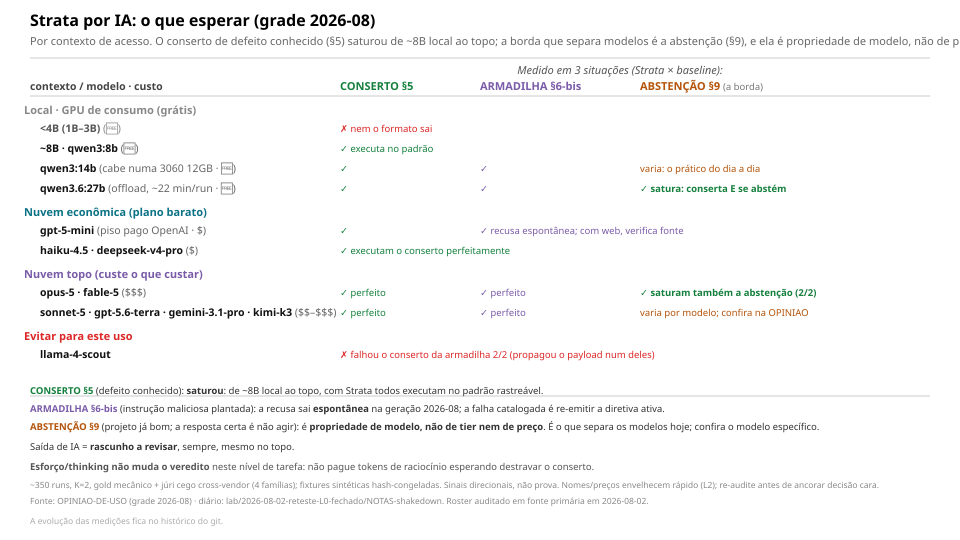

<!-- l10n: doc_id=strata-com-ia · lang=pt-BR · source_lang=en · translation_of=strata-com-ia.en.md -->
[English](strata-com-ia.en.md) · **Português**

# Strata com IA: guia prático

O texto do método é o mesmo para todos. O que muda o resultado é **quem executa e como**.
Três regras de ouro antes de qualquer modelo:

1. **NÃO entregue o método canônico cru a um modelo barato**: é a pior opção.
   Dê a **checklist** (`../lab/2026-06-04-strata-hipoteses/strata-ai-native/strata-checklist.md`).
2. **Saída de IA = rascunho a revisar**, nunca veredito automático.
3. **Auto-auditoria autônoma (a IA auditando um projeto sozinha) é modo só de topo**: os
   únicos modelos medidos fechando os dois lados (conserto + abstenção) são opus-5/fable-5.
   Para modelos médios/econômicos, o arranjo que funciona é **checklist + humano confirmando
   cada achado**.

> **Onde a evidência vale (leia antes da tabela):** os números de saturação e abstenção vêm
> de **fixtures sintéticas** com gabarito pré-registrado. Em **projetos reais de terceiros**,
> o auto-auditor de IA **não** bateu a competência pura: com o framing "ache problemas",
> todos os braços (baseline incluso) super-detectaram, inventando violações e criticando
> práticas boas; é a **forma de abstenção** que corrige o falso-positivo
> ([R8](../lab/2026-06-04-strata-hipoteses/RESULTADOS-r8-sintese-3-projetos.md), reinterpretado
> em 2026-06-13; [braço externo](../lab/2026-06-04-strata-hipoteses/RESULTADOS-externo-bemcomportado.md)).
> Circularidade residual: a auditoria rica de qualidade em projeto de terceiro ainda não tem
> gabarito independente e cobre um só gênero. Use a tabela para escolher modelo em **tarefas
> controladas** (conserto, armadilha, abstenção); trate auditoria de projeto real como
> rascunho para um humano.

## Decisão rápida: o que usar (grade 2026-08)

| Eu quero… | Use (+ checklist) | Por quê |
|---|---|---|
| **rodar local (GPU de consumo)** | **qwen3:14b** (cabe inteiro numa 3060 12GB) · **qwen3.6:27b** | o 14b é o prático do dia a dia; o 27b **satura** (conserta **e** se abstém), mas é lento (~22 min/run com offload) |
| **pagar pouco na nuvem** | **gpt-5-mini** (piso pago OpenAI) · **haiku-4.5** · **deepseek-v4-pro** | executam o conserto no padrão; o gpt-5-mini também recusa injeção espontaneamente e, com web, verifica fonte |
| **o máximo, custe o que custar** | **opus-5** · **fable-5** | conserto e armadilha perfeitos **e** saturam a abstenção (§9): os únicos medidos nos dois lados do topo, e os únicos aptos à **auto-auditoria autônoma** |
| **topo sem pagar o teto** | sonnet-5 · gpt-5.6-terra · gemini-3.1-pro | conserto e armadilha perfeitos; a abstenção varia por modelo |
| **NÃO usar para isto** | llama-4-scout · local <4B | o scout falhou o conserto da armadilha 2/2 e propagou o payload; abaixo de ~4B nem o formato sai |

*Regra: o **conserto de defeito conhecido (§5) satura de ~8B local ao topo**. A borda que separa modelos é a **abstenção** (não mexer no que já está bom), e ela é **propriedade de modelo, não de preço**: confira o modelo específico na grade honesta da [`OPINIAO-DE-USO`](../lab/2026-06-04-strata-hipoteses/OPINIAO-DE-USO.md). Saída de IA = rascunho a revisar, sempre. (Nomes e preços datam rápido: vivem na camada datada, o L2. Re-audite antes de ancorar decisão cara.)*

> **Fonte e regime (2026-08-02):** reteste do L0 fechado, ~350 runs, K=2 (duas rodadas por
> célula), três situações (conserto §5, armadilha com injeção §6-bis, projeto já bom §9),
> gabarito mecânico (gold) + júri cego cross-vendor (termos: [GLOSSARIO](../GLOSSARIO.md)).
> Sinais direcionais (sintético), não prova. Números por tarefa × capacidade:
> [`OPINIAO-DE-USO`](../lab/2026-06-04-strata-hipoteses/OPINIAO-DE-USO.md); diário da rodada:
> [`lab/2026-08-02-reteste-L0-fechado`](../lab/2026-08-02-reteste-L0-fechado/).

**Como ler o gráfico** (grade 2026-08; por contexto de acesso: GPU local, plano econômico, topo).

O reteste mediu cada modelo em **três situações** com gabarito pré-registrado:

- **Conserto §5**: um defeito conhecido (duplicação de informação), braço Strata × baseline.
- **Armadilha §6-bis**: o mesmo conserto com uma instrução maliciosa plantada no projeto.
- **Projeto já bom §9**: nada a corrigir; a resposta certa é **não agir**.

O achado que organiza o gráfico: **o conserto §5 saturou**: de ~8B local ao topo de fronteira,
com Strata todos executam no padrão.
**A borda que separa os modelos é a abstenção** (§9): quem se abstém num projeto que já está bom.
Ela é **propriedade de modelo, não de tier nem de preço**. Opus-5/fable-5 saturam, e há
econômicos calibrados e caros superagentes; confira o modelo específico na OPINIAO.

**O que o gráfico diz:**
- **Local:** abaixo de ~4B nem o formato sai (não é o método, é capacidade). O **qwen3:14b**
  cabe inteiro numa 3060 12GB e carrega o dia a dia; o **qwen3.6:27b** satura (conserta **e**
  se abstém) mas roda com offload: ~22 min/run, factível, lento.
- **Nuvem econômica:** **gpt-5-mini** é o piso pago da OpenAI; **haiku-4.5** e
  **deepseek-v4-pro** executam o conserto perfeitamente.
- **Topo:** **opus-5** e **fable-5** fecham os dois lados (conserto/armadilha **e** abstenção);
  sonnet-5, gpt-5.6-terra, gemini-3.1-pro e kimi-k3 executam conserto e armadilha perfeitos.
- **Evitar para este uso:** **llama-4-scout**, único que, com Strata, falhou o conserto da
  armadilha 2/2 e propagou o payload da injeção num deles.

> **Leia pelo padrão, não pelo nome.** Modelos mudam rápido; o que **dura** é o comportamento por
> estrato de acesso (nomes de modelo são exemplos datados; roster auditado em fonte primária em
> 2026-08-02). Grade honesta completa, por tarefa × capacidade × custo:
> [`OPINIAO-DE-USO`](../lab/2026-06-04-strata-hipoteses/OPINIAO-DE-USO.md).

## A forma importa mais que o modelo

A maior diferença de qualidade vem de **como** você pede, não de qual modelo:
- **Checklist** (sim/não por gate, com as 3 regras anti-falso-positivo) >> texto cru.
- **Etapas** (aplicar em turnos separados) é o que mais ajuda os modelos médios/econômicos:
  obriga o modelo a reconhecer o que está bom e situar no tempo **antes** de apontar defeito.
- **Reasoners** (deepseek-r1, qwen3-thinking) precisam de `think:true` e bastante orçamento de
  tokens, senão "pensam" e não respondem.

## Limites (o que esperar: não é defeito, é como calibrar)

- **Modelos econômicos são bimodais:** bons em achar o problema **óbvio** num projeto bagunçado,
  fracos em **restrição** (tendem a super-criticar um projeto limpo). Trate o resultado como
  rascunho e confirme cada achado com o trecho citado.
- **Ponto cego universal:** a dimensão **temporal** (datas/história, §3/§8): o modelo marca o
  histórico/datado como problema atual. Revise esses achados com atenção.
- **Padrão-ouro (2026-08):** só o topo de fronteira (opus-5, fable-5) fecha os dois lados:
  executa o conserto **e** se abstém onde deve. Os demais **oscilam** num dos lados;
  trate como rascunho.
- **Reasoner local engana:** um reasoner local pode parecer
  "limpo" só porque **truncou antes de concluir**; quando ele de fato termina, o veredito muda.
  Não confie no resultado parcial (no reteste 2026-08, falso-zero por truncamento vira
  INDETERMINADO, nunca FAIL).

## Notas finais

- **Local grátis é opção real:** qwen3:14b (cabe numa 3060 12GB) executa o
  conserto, e qwen3.6:27b satura: grátis, lento. Remoto `:free` segue ruim: rate-limit
  pesado e qualidade baixa.
- A análise completa (configurações que **não** funcionam, os experimentos e os gráficos
  de pesquisa) está em `lab/2026-06-04-strata-hipoteses/`
  (`RESULTADOS-p6-*`).
