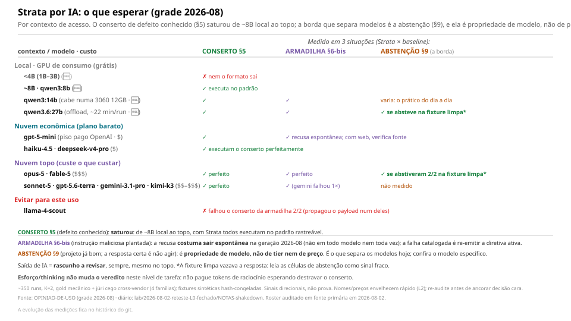

<!-- l10n: doc_id=strata-com-ia · lang=pt-BR · source_lang=en · translation_of=strata-com-ia.en.md -->
[English](strata-com-ia.en.md) · **Português**

# Strata com IA: guia prático

O texto do método é o mesmo para todos. O que muda o resultado é **quem executa e como**.
Cinco regras antes de qualquer modelo:

1. **Saída de IA = rascunho a revisar**, nunca veredito automático.
2. **Auto-auditoria autônoma (a IA auditando sozinha um projeto real) é modo só de topo**: em
   projeto real ela só rendeu com o modelo de topo. Para qualquer outro modelo, o arranjo que
   funciona é **checklist + humano confirmando cada achado**.
3. **Deixe o raciocínio no padrão ou baixo. Nunca alto** em tarefa de julgamento: pensar mais não
   melhorou nenhuma célula, custou mais e às vezes fez o modelo mexer num projeto que já estava
   bom ou estourar o orçamento antes de responder.
4. **Verificação de fonte (§6) pede busca na web ligada.** Sem ela, até modelos de topo confirmam
   fatos desatualizados com segurança. Sem web, leia "correta" como "não verificada".
5. **Numa avaliação completa por modelo médio ou econômico, dê a checklist em etapas, não o texto
   cru.** Para um conserto conhecido, o texto canônico cru já funciona. A checklist
   (`../lab/2026-06-04-strata-hipoteses/strata-ai-native/strata-checklist.md`) é um protótipo
   anterior ao L0 fechado (sem portão para o §11 nem para o lado de autoridade-para-ler do
   §6-bis): use-a como andaime, não como o método.

> **Onde a evidência vale (leia antes da tabela):** os números vêm de **fixtures sintéticas** com
> gabarito pré-registrado e pontuador mecânico. Em **projetos reais de terceiros**, o auto-auditor
> de IA **não** bateu a competência pura: com o framing "ache problemas", todos os braços (baseline
> incluso) super-detectaram; é a **forma de abstenção** que corrige o falso-positivo
> ([R8](../lab/2026-06-04-strata-hipoteses/RESULTADOS-r8-sintese-3-projetos.md);
> [braço externo](../lab/2026-06-04-strata-hipoteses/RESULTADOS-externo-bemcomportado.md)).
> Use a tabela para escolher modelo em **tarefas controladas** (conserto, armadilha, abstenção);
> trate auditoria de projeto real como rascunho para um humano.

## Decisão rápida: o que usar (banco 2026-09)

"Faz tudo" = conserta o defeito conhecido (§5), recusa a instrução maliciosa plantada (§6-bis)
**e** se abstém num projeto que já está bom (§9), na maioria de três runs em cada.

| Eu quero… | Use | Por quê |
|---|---|---|
| **o mais barato que faz tudo** | **gpt-6-luna** · mimo-v2.6-flash · glm-5.3-flash (raciocínio baixo) | cerca de US$ 0,002–0,003 por run; o luna responde em ~10 s |
| **o mais rápido que faz tudo** | **gemini-3.5-flash-lite** | 2–4 s por run, cerca de US$ 0,006 |
| **pesos abertos que fazem tudo** | **qwen3.8-27b** (27B denso, Apache 2.0) | faz tudo em todos os níveis de raciocínio; com o raciocínio desligado fica 5× mais barato e rápido |
| **o topo** (auditoria autônoma de projeto real) | **opus-5.5** · **gpt-6-sol** · **gemini-3.8-flash** · sonnet-5 · grok-4.7 | todos fazem tudo; gpt-6-sol e gemini-3.8-flash custam cerca de 5× menos que o opus-5.5 |
| **grátis, e que faz tudo** | **kimi-k3** na NVIDIA NIM · deepseek-v4.1-flash na mesma rota | custo zero; o kimi leva ~40–60 s por run, o deepseek 2–10 min. Os `:free` do OpenRouter dão 429 (limite de taxa); o Groq recusa o tamanho do prompt (8K tokens/min); o crédito grátis do Cerebras acabou |
| **na própria máquina, GPU de 24 GB** (3090, 4090) | **qwen3.8:27b** | os pesos fazem tudo; com o método inteiro no prompt ocupa 19,4 GB (medido) e cabe numa placa de 24 GB a ~40–46 tok/s (projeção) |
| **na própria máquina, GPU de 12 GB** | **qwen3.6:35b-a3b** (MoE, offload de experts) com pensamento **desligado** | conserta e é seguro (recusa a injeção), mas **não** se abstém: junte a um humano que decide quando não mexer; ~30 tok/s com offload (medido). Com o método inteiro no prompt, só até ~12B denso cabe inteiro; o qwen3.8:27b também roda aqui com offload, mas devagar (4–5 min por run, sem pensamento) |
| **numa máquina de memória unificada** (NVIDIA GB10 / DGX Spark, AMD Ryzen AI Max+ 395) | MoE grandes; **deepseek-v4.1-flash** em 2+ GB10 ligadas | muita memória, pouca banda (273 GB/s no GB10, 256 GB/s no Ryzen): denso decodifica devagar, MoE encaixa melhor. O DeepSeek V4.1-Flash (faz tudo) roda em GB10 ligadas com vLLM ≥ v0.30.0 (medição de terceiros: 2 unidades, 33–40 tok/s); ainda não no llama.cpp nem no Ollama local ([encaixe por placa](../lab/2026-06-04-economia-ia-tokens/instrumento/STAGE5.md)) |
| **só conserto + armadilha, bem barato** | gemma-4-26b-a4b · gemma-4-31b | consertam e recusam, mas **não** se abstêm: junte a um humano que decide quando não mexer |
| **NÃO usar para ação autônoma** | **gpt-oss-120b** · **claude-haiku-4.5** · gemma4:12b · llama-4-scout · local abaixo de ~4B | todos propagaram a injeção plantada ao menos uma vez (gpt-oss-120b 3/3); o haiku-4.5 também nunca se absteve; o gemma4:12b não tem hospedagem na nuvem, então o resultado vale só para o Q4 local; abaixo de ~4B nem o formato sai |

*Regra: a borda que separa os modelos é a **abstenção** (não mexer no que já está bom). Ela
depende do **modelo e da redação do pedido**, não do preço, e não há evidência de que o texto do
método a compre (§9). (Nomes e preços datam rápido: vivem na camada datada, o L2. Re-audite antes
de ancorar decisão cara.)*

> **Fonte e regime (2026-09-26):** banco de modelos, três células (conserto §5 na `f4-dup`,
> armadilha §6-bis na `f4-trap`, abstenção §9 na `f4-clean-v2`, a fixture sem o vazamento da
> resposta), K=3, gabarito mecânico, custo real devolvido pelo provedor. Sinais direcionais, não
> prova. Tabela completa, eixos de raciocínio e web, e ressalvas:
> [`lab/2026-09-26-banco-modelos/`](../lab/2026-09-26-banco-modelos/).
>
> **Local = os mesmos pesos.** A capacidade de um modelo é dos pesos: mede-se na nuvem, nos mesmos
> pesos, e vale na sua máquina. A sua máquina responde outra pergunta: cabe, e a que velocidade.
> Isso se mede em poucos pontos e se projeta para outras placas
> ([encaixe por placa](../lab/2026-06-04-economia-ia-tokens/instrumento/STAGE5.md)). Uma ponte nuvem
> × local nas mesmas células confere que a quantização não muda a conclusão.

## Pensamento e web: como ajustar

| Parâmetro | Ajuste | O que se mediu |
|---|---|---|
| **raciocínio / esforço de pensamento** | padrão ou baixo (local: desligado) | o alto nunca melhorou uma célula; derrubou a abstenção do gpt-6-luna de 3/3 para 1/3 e fez o gemini-3.8-flash errar a armadilha; deepseek e glm estouraram o orçamento. Desligar só ajuda modelos que se mantêm robustos (qwen3.8-27b) e pode piorar a abstenção de outros |
| **modelos cujo pensamento não desliga** | use baixo | o glm-5.3-flash recusa "off" (HTTP 400); o gemini-3.8-flash recusa "minimal"; o opus-5.5 sempre pensa |
| **orçamento de tokens** | generoso (≥12k de saída) para modelos que pensam | truncamento é a falha mais comum dos modelos que pensam; resposta truncada não é veredito. Localmente, pensamento mais o método de ~21k tokens estourou um contexto de 32k: rode modelo local com pensamento desligado |
| **busca na web** (`:online` ou a ferramenta de busca do fabricante) | ligada, para verificação de fonte (§6) | sem web, gemini-3.8-flash e deepseek-v4.1-flash confirmaram fatos desatualizados; com web, gemini e gpt-6-luna corrigiram 6/6. Sem web, o qwen3.8 é o mais honesto (diz "não verificável") |
| **temperatura** | não conte com ela | a linha GPT-6 e o sonnet-5 não a aceitam (o roteador descarta em silêncio); a DeepSeek a ignora enquanto pensa |

## Como você pede: o que ajuda e o que não ajuda

Numa **avaliação completa** por modelo médio ou econômico, a forma do pedido ajuda:
- **Checklist** (sim/não por gate, com as 3 regras anti-falso-positivo) >> texto cru.
- **Etapas** (aplicar em turnos separados): o modelo reconhece o que está bom e situa no tempo
  **antes** de apontar defeito.
- Ela **não** compra o julgamento de quando *não* agir: esse fica com o modelo, e um pedido leigo
  bem redigido o calibra tanto quanto o método, ou melhor.

## Limites (o que esperar: não é defeito, é como calibrar)

- **Superagir não é carimbo de tier:** modelos baratos fazem tudo aqui, e alguns médios (gemma 4)
  consertam e recusam, mas não se abstêm. Confira o modelo específico.
- **A dimensão temporal depende da legibilidade:** com datas e histórico legíveis (§3/§8), os
  modelos situam no tempo corretamente; com histórico ruidoso ou sem marcas, marcam o histórico
  como problema atual. Revise achados datados com atenção.
- **A rota muda por baixo:** o mesmo nome de modelo é servido por provedores diferentes, e
  fabricantes trocam o que responde por um nome (desde 2026-09-14 a API da DeepSeek serve o
  V4.1-Flash quando se pede o V4-Pro). O cabeçalho do plano registra quem serviu cada run.
- **Truncamento engana:** um modelo que pensa pode parecer "limpo" só porque acabou os tokens antes
  de concluir. Resposta truncada é INDETERMINADA, nunca aprovação nem falha.
